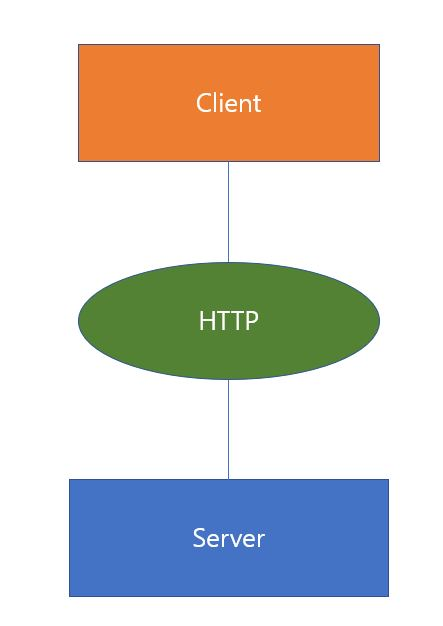
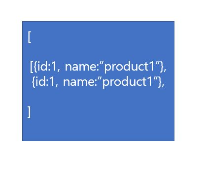

# RESTful API 에 대해서

Clinet와 Server가 데이터를 교환하기위해서는 restful api가 필요하다. 그렇다면 그것에 대해서 알아보자.

## 구조

- Client
- Server
- HTTP Protocol
  
   
   

  Client와 Server간에 데이터를 교환하기 위해서는 HTTP라는 네트워크 통신을 하기 위한 프로토콜을 사용한다. HTTP로 데이터가 서버로 전달될때 method라는 속성을 사용하고 method는 데이터를 보내는 목적을 나타내는 역할을 한다. 이 목적은 CURD Operation을 의미한다.
   
   

- CURD Operation
  - Create : 생성(POST)
  - Read : 조회(GET)
  - Update: 수정(PUT)
  - Delete: 삭제(DELETE)

 
 

## REST API vs Frontend Route

그렇다면 REST API와 Frontend Route가 무엇이 다른 것일까? REST API는 데이터는 DB에서 가져온다. 그걸 HTTP 통신을 통해 넘겨 받은 프론트엔드에서는 데이터를 원하는 페이지에 알맞은 형태로 Rendering해 보여준다. 따라서 REST API의 형태는 JSON이나 XML의 형태일 꺼고 Route 데이터는 우리가 흔히 볼수 있는 랜더링된 브라우저 화면의 형태일 것이다.

##### REST API

http:example.com/api/v1/test

##### Frontend Route

http:example.com/api/test

 
 

## HTTP Methods

### GET

서버에게 Resource를 보내달라고 요청한다. 여기서 전달만 될뿐 데이터를 변경할 때는 사용하지 않는다. 원하는 데이터의 맞는 조건을 넣기위해 URL에 변수(데이터)를 포함시켜 요청할 수 있으며 따라서 데이터가 노출되어 보안에 약하다. 데이터를 Header에 포함하여 전송한다.

다른 말로 간단한 데이터를 URL에 넣어 데이터를 보내는 양에 한계가 있다.

ex)

<u>Request</u>

GET : http://exmaple.com/api/v1/products

<u>Response</u>

[

{ id1, name:"product1"},

{ id1, name:"product2"},

]
 
 

### POST

서버에게 resource를 보내면서 DB에 추가 혹은 수정해달라고 요청할 때 사용한다. 여기서  GET과 다른점은  URL에 변수(데이터)를 노출하지 않고 요청한다는 것이다. 왜냐하면 데이터를 URL이 아닌 Body에 포함시키기 때문이다. 이때 Body의 데이터가 어떤 Content-Type(Json, xml....) 인지 명시해 주어야한다.

ex)

<u>Request</u>

POST : http://exmaple.com/api/v1/products
{ name:'name, image:upload/img-1 }

<u>Response</u>

{
id:1,
name: 'new_name',
image:upload/img-1
}

 
 

### PUT

서버에게 DBresource의 업데이트를 요청할 때 사용된다.

ex)

<u>Request</u>

PUT : http://exmaple.com/api/v1/products/1

{ name: 'product_new_name' }

<u>Response</u>

{ id:1, name:"product-new-name"}
 
 

### DELETE

DB, 서버에 존재하는 resource의 삭제를 요청할 때 사용한다.
ex)

<u>Request</u>

DELETE : http://exmaple.com/api/v1/products/1

{ name: 'product-new-name' }

<u>Response</u>

{ success:true}
 
 

### 의문점

그렇다면 결국엔 POST와 GET모두 데이터를 전달할 수 있다는 것인데 양이 애매하거나 많지 않은 경우 GET과 POST중 무엇을 써야할지 헷갈릴 때가 있다. 이때 한 개념만 가지고 있으면 선택을 좀 더 쉽게 할 수 있다. GET은 SELECT적인 성향을 가기고 있다. POST는 서버의 값이나 상태를 바꾸기 위해 사용한다는 것이다. DB가 수정되고 추가되는 문제는 굉장히 중요하다. 꼭 사용자가 클릭한 순간이나 의도적인 순간에만 URL이 발생되어 수정되어야한다. 애초에 GET과 POST를 나누어논 이유도 이것이라고 한다.
 
 

## 마무리

언젠간 한번은 내글로 정리해봐야 겠다고 결심했던 주제이다. 웹 프로그래머라면 당연히 알고있어야할 기본 개념이며 머리속으로만 알고 여태 프로그래밍 했던것보다 이렇게 내것으로 정리할 수 있어서 좋았다.

## References

- https://www.a-mean-blog.com/ko/blog/Node-JS-%EC%B2%AB%EA%B1%B8%EC%9D%8C/Hello-World/HTTP-Methods-HTTP-Verbs-GET-POST-PUT-PATCH-DELETE
- https://blog.outsider.ne.kr/312
- https://mangkyu.tistory.com/17

