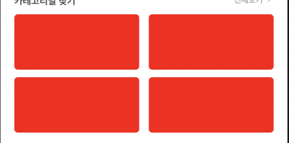

## Flex Direction 배치

과연 View에서 같은 요소들을 테이블 형식으로 만드는 것은 어떻게 하는 것일까?


위의 그림처럼 자식요소들을 동일한 간격으로 가로, 세로로 쌓기 위해서는 <span style="color:blue">Flex Direction</span> 스타일을 사용한다.
<br/>
<br/>

### Flex Box의 큰 특징

1. 컨테이너에 적용할 수 있는 속성과 아이템에 적용할 수 있는 속성들이 존재한다.
   
   <br/>

2. flex는 중심축과 반대축이 있다.

#### container를 위한 요소

- display
- flex-direction
- flex-wrap
- justify-content
- align-items
- align-content

#### container를 위한 요소

- order
- flex-grow
- flex-shrink
- flex
- align-self

<br/>
<br/>

### 2 X 2 행렬로 요소 배치하기

<span style="color:blue">flex-direction</span>에서 row는 가로 배치, column은 세로 배치를 뜻한다. 따라서 container의 스타일에서 <span style="color:blue">row</span>로 지정해준다. 하지만 4개의 요소가 나란히 배치되어 튀어나가는 현상이 생길것이다. 따라서 우리는 <span style="color:blue">flex-wrap</span>을 <span style="color:blue">wrap</span>으로 지정하여 화면을 튀어나갈시 다음줄로 이동하게 해야한다. 만약 나란히 배치하고 싶다면 no-warp을 사용하여주면 된다.

```javascript
 <View

        style={{
          flexDirection: 'row',
          flexWrap: 'wrap',
        }}>
        {
            items.map((item)=>
            (
            <Card
                padding
                style={{
                    backgroundColor: 'red',
                    borderRadius: 5,
                    width: screenWidth / 2.3,
                    height: 80,
                }}></Card>
            ));
        }
      </View>
```

- 결론

  flex나 flex-direction은 정말 많이 사용되는 스타일중 하나이다. 언제한번 날잡아서 제대로 공부하고 싶은 생각이 들었으나 지금까지 미뤄왔다. flex-direction의 대한 집중 포스팅을 하나 이행해야겠다는 생각이 들었다.
